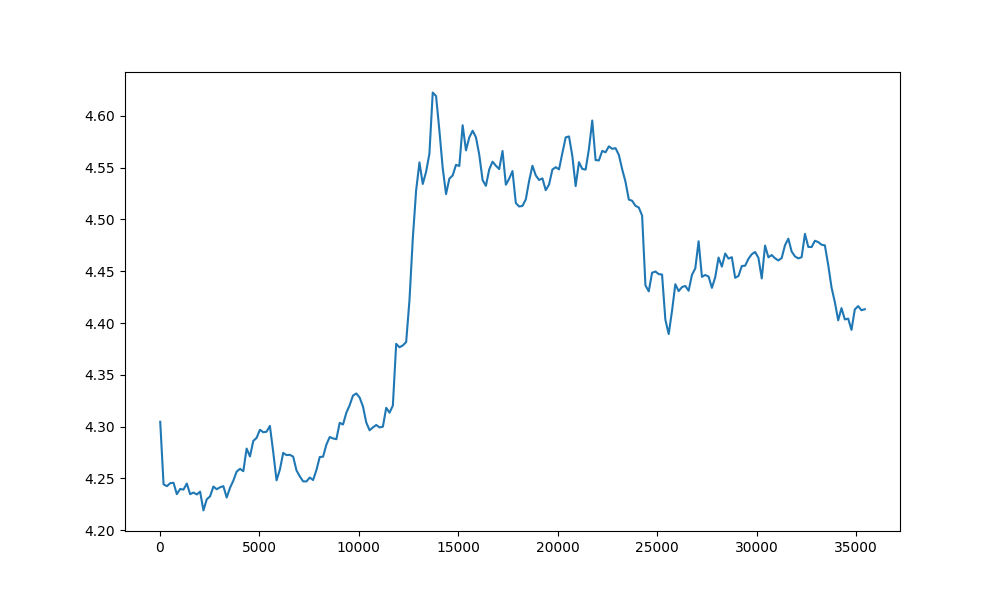

<h2>BeatifulSoup for Web Scraping</h2>
<h3>Intro</h3>
<ul>
  <li>BeatifulSoup is Python library for literally scraping data from a webpage.</li>
  <li>It extracts all data you need from the HTML tags you define in the program.</li>
  <li>You are able to define BASE CURRENCY agains QUOTE CURRENCY f.e. EUR against USD to see how many USD you would need to pay for 1 EUR.</li>
  <li>The final output is in Pandas dataframe which then is saved as csv.</li>
  <li>CSV file with currency rates can undergo any further analysis either for spend reporting puropse or for making investments decisions.</li>
</ul>
<h3>Plotting data</h3>

